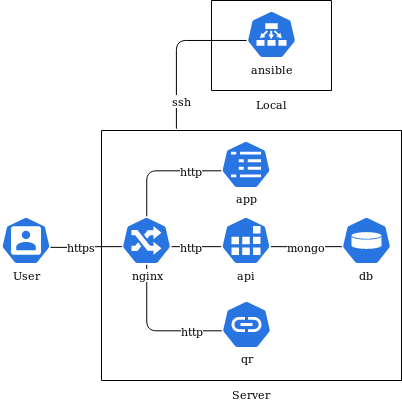

# Hosting

In this document, the requirements for the server operating the LabTrail application are recorded.

## Container

The services of the LabTrail application are created and published as Docker containers.

The following 5 containers run on the Docker host:

**labtrail/app**

Description: Client application  
Docker Image: node:10-alpine

**labtrail/api**

Description: Data interface  
Docker Image: node:10-alpine

**labtrail/qr**

Description: QR-Code redirect  
Docker Image: node:10-alpine

**labtrail/nginx**

Description: Proxy for services  
Docker Image: nginx:15.2-alpine  

**labtrail/db**

Description: Database  
Docker Image: mongo:4.4.2

In addition a schematic representation of how the containers are linked together:

## Connections

In order for the application to be accessible from the outside and installed by the provider, the following connections must be allowed:

* HTTPS: Port 443 for access via browser
* SSH: Port 22 or other

### domain

The application is available at [https://labtrail.lsfm.zhaw.ch](https://labtrail.lsfm.zhaw.ch). SSL certificates are required to secure the connection. If these are not provided by the hoster, the following connection must be enabled as well.

* HTTP: Port 80 for [Let's Encrypt ACME challenge](https://letsencrypt.org/docs/allow-port-80/)

The SSL certificates are created with Let's Encrypt if required.

## Deployment

The installation of Docker and the containers is done with [Ansible](https://www.ansible.com/). As part of the project implementation an [Ansible Playbook](https://docs.ansible.com/ansible/latest/user_guide/playbooks.html) is provided. The playbook contains instructions for server configuration and deployment of the LabTrail application.

### key management

Keys, secrets and certificates are stored and encrypted with an Ansible Vault. The Vault Key is stored on the server in an access-protected manner.

## Requirements

The server must meet the following requirements to run the LabTrail application:

* [Docker support](https://docs.docker.com/install/linux/docker-ce/ubuntu/) available
* Installation of software packages with [Aptitude](https://help.ubuntu.com/lts/serverguide/aptitude.html) or [Snap](https://snapcraft.io/) possible
* Root access (sudo) allowed
* SSH access with public key allowed
* Outgoing connections allowed
  * [Docker Hub](https://hub.docker.com/)
  * [Sentry](https://sentry.io)
  * [GitHub](https://github.com/)
* Diskspace at least 10 GB (with OS) available
* Persistence of files under /usr/share allowed